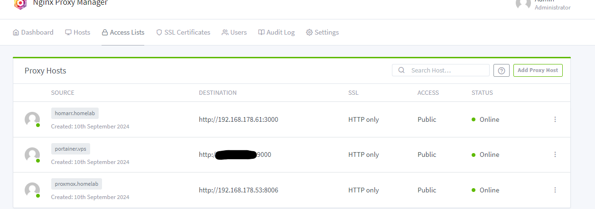

# How to use custom hostnames in your local network
## AdGuard Home (DNS) + Nginx Proxy Manager

This guide explains how to set up **AdGuard Home** for local DNS resolution and **Nginx Proxy Manager** to forward a local domain name to an IP address within your local network.

## Prerequisites
- **AdGuard Home** installed and running.
- **Nginx Proxy Manager** installed and configured in your network.

---

## Step 1: Configure Local DNS in AdGuard Home

- Open your web browser and go to the AdGuard Home admin interface.
- Go to **Filter** > **DNS Rewrites**.
- Scroll down to the **DNS Rewrites** section.
- Click **Add DNS Rewrite**.
  - **Domain name**: `*.homelab` (or any local domain name you want to use)
  - **IP Address**: `192.168.178.5` (Replace with the local IP address of Nginx)
- Repeat with any suffix you like
- Save the changes.

Now, any device in your network using AdGuard as its DNS server will resolve `*.homelab` to your Nginx reverse proxy.

---

## Step 2: Set Up Nginx Proxy Manager

- Open the Nginx Proxy Manager dashboard.
- Go to **Hosts** > **Proxy Hosts**.
- Click **Add Proxy Host**.
  - **Domain Names**: Enter `proxmox.homelab`.
  - **Scheme**: Select `http` (or `https` depending on your service).
  - **Forward Hostname / IP**: Enter the internal IP, e.g., `192.168.178.53`.
  - **Forward Port**: Enter the port of your service, e.g., `8006` for Proxmox.
- Save the proxy host.

You can also add any IP address outside of your local network. For example, you can configure access to your VPS by assigning it a custom hostname instead of typing the IP address every time. This is especially useful when you want to avoid exposing services on a public domain but still access them easily through a VPN using a clean, memorable name.

Now, any request to `proxmox.homelab` will be forwarded by Nginx Proxy Manager to the internal IP address.

