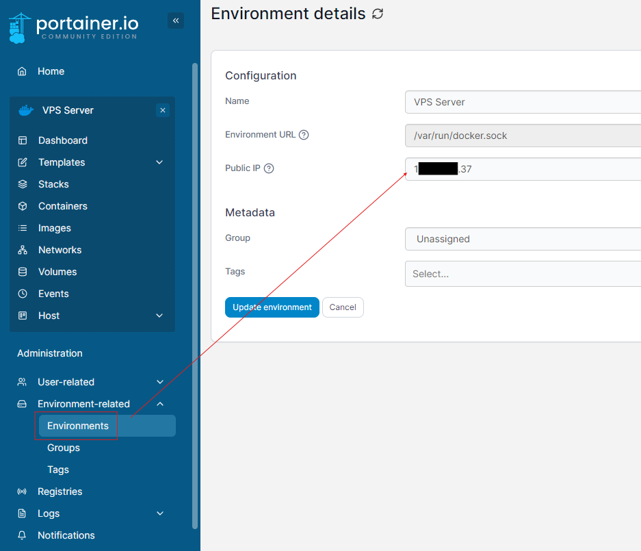
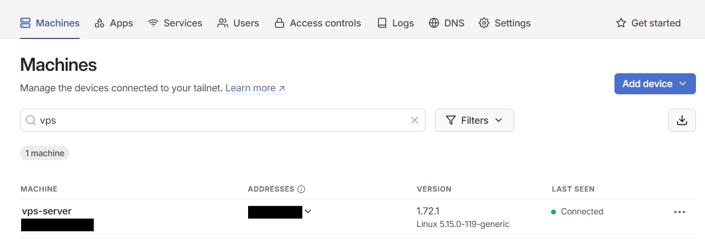

# Set up and configure the VPS Proxy Server

## 1. Install Docker
```cmd
sudo apt-get update && sudo apt-get upgrade -y

sudo apt install curl

curl -fsSL https://get.docker.com -o get-docker.sh | sudo sh get-docker.sh

sudo apt install docker-compose
```

## 2. Install Portainer
```cmd
docker volume create portainer_data

docker run -d -p 8000:8000 -p 9000:9000 --name=portainer --restart=always -v /var/run/docker.sock:/var/run/docker.sock -v portainer_data:/data portainer/portainer-ce
```

1. Open your Portainer-UI: http://{VPS-IP}:9000/
2. Change your Public IP in Portainer for your VPS IPv4:
    - Environment-related
    - Environments
    - Select your Server
    - Change Public IP

    

## 3. Install Tailscale
Install Tailscale:
```bash
curl -fsSL https://tailscale.com/install.sh | sh
```
Get Tailscale online and accept routes (important!):

```bash
sudo tailscale up --accept-routes
```
Check the status of Tailscale to ensure it is running properly:


```bash
sudo tailscale status
```


It should show an url to https://login.tailscale.com/xxxxxx

Click on it or copy to your browser. It asks for you to login or create an account. I did this with github, but you can choose whatever you prefer. After the login/register you see your machines inlcuding your just registered VPS Server. You can edit your machine name

