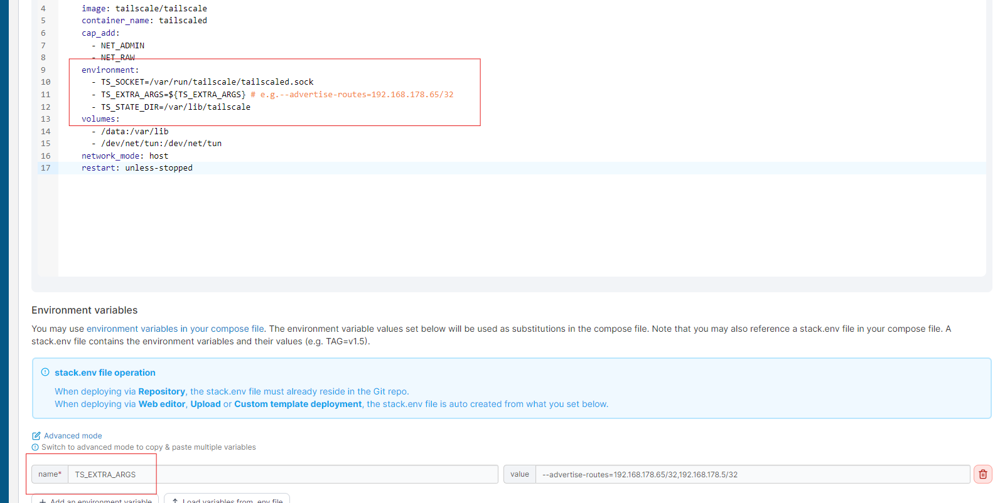
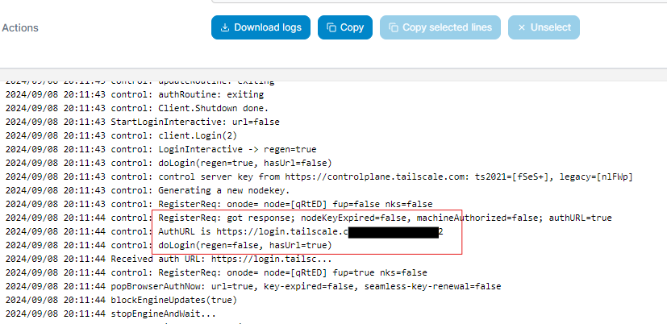
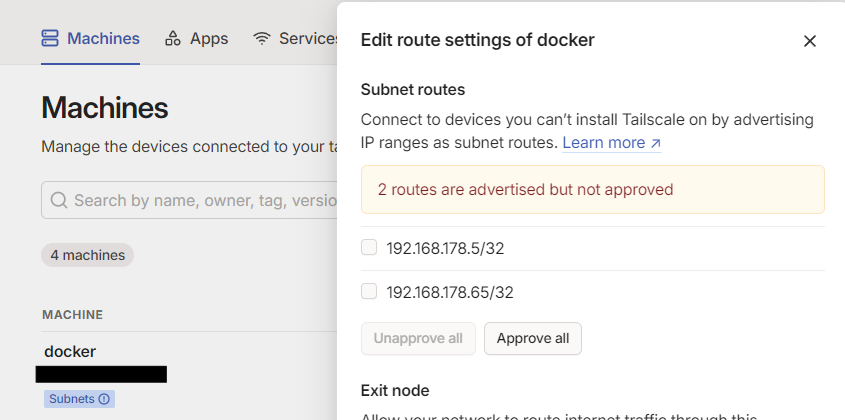

# Install Tailscale on Portainer

## 1. Create Portainer Stack
I will be using the file from this user:
[Docker Compose](https://gist.github.com/bnhf/fed4cc3035f32a0f086b1da074a3d50b)

You first need to adjust your docker compose file. This one works for me, but there are more variables, you can find in the link above.
```yaml
version: '3.9'
services:
  tailscale:
    image: tailscale/tailscale
    container_name: tailscaled
    cap_add:
      - NET_ADMIN
      - NET_RAW
    environment:
      - TS_SOCKET=/var/run/tailscale/tailscaled.sock 
      - TS_EXTRA_ARGS=${TS_EXTRA_ARGS} # e.g.--advertise-routes=192.168.178.65/32
      - TS_STATE_DIR=/var/lib/tailscale
    volumes:
      - /data:/var/lib
      - /dev/net/tun:/dev/net/tun
    network_mode: host
    restart: unless-stopped
```

This is what it looks like in Portainer. Don't forget to add the Environment variables:
- TS_EXTRA_ARGS
- --advertise-routes=192.168.178.65/32,192.168.178.5/32 



After the deployment you need to open the log and look for the link.


Follow the link to authenticate your Portainer with your Tailscale account. Click on "Edit route settings" and approve all.


Now you can test your connection and ping the endpoint from your VPS.

```bash
ping 192.168.178.5
```

If you want to add new routes after you have deployed your stack, you can update your stack:
- Open the Editor
- Open Environment variables
- Add the new IP and Update the stack
- Edit route settings on the website