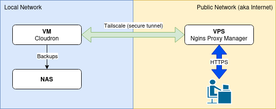

# Introduction

This guide will walk you through the process of installing and configuring Tailscale with Nginx, and setting up forwarding from a VPS to a local homelab running Proxmox or Portainer. Tailscale is a zero-config VPN and Nginx serves as a reverse proxy.

**Note:** Tailscale is managed remotely by the Tailscale team. If you prefer a self-hosted solution, consider using self-hosted [Headscale](https://github.com/juanfont/headscale), an open-source implementation of the Tailscale control plane.

By the end of this guide, you will:

1. Install Tailscale on a VPS and Proxmox server / Portainer.
2. Configure Nginx on the VPS to forward requests to your homelab server.
3. Add routes to all your services you want to expose
4. Learn how to add your custom domain

Picture from https://forum.cloudron.io/topic/11621/guide-how-to-host-cloudron-behind-a-reverse-proxy-with-tailscale